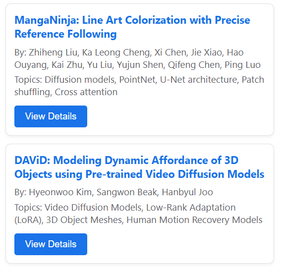
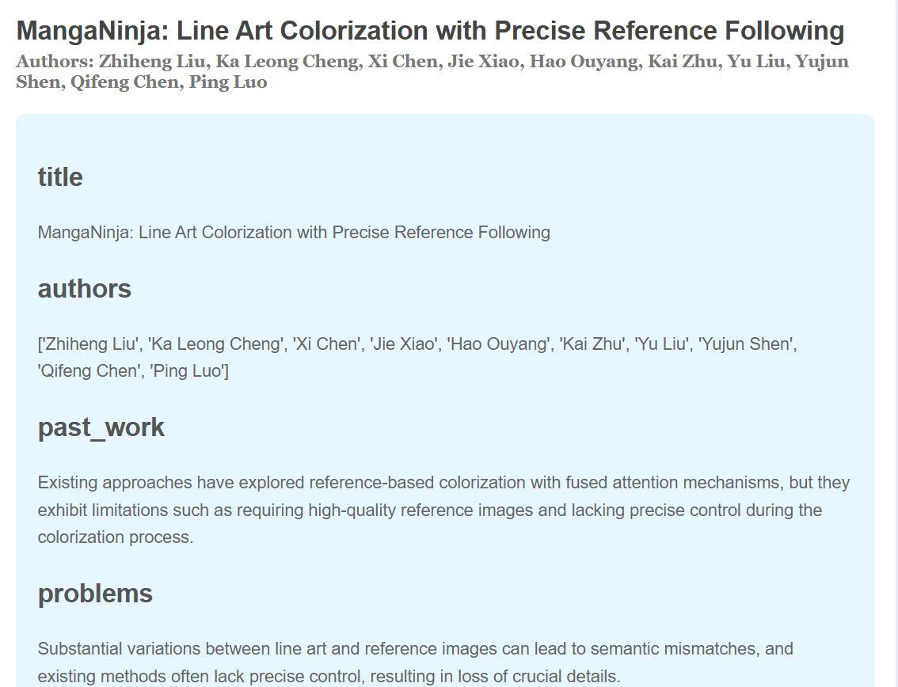

# Daily AI Research Papers Chrome Extension

A Chrome extension that shows daily research papers in AI with detailed explanations using AI-powered analysis using LLM from OpenAI, OLLAMA, LMStudio.

## Features

- Daily updates of new AI research papers from arXiv
- AI-powered paper analysis and summarization using AI Agent (used CrewAI for agent orchestration)
- Section-wise paper explanations
- Easy-to-use Chrome extension interface
- MongoDB-based storage for processed papers

## Setup

### Prerequisites

- Python 3.11
- MongoDB
- Chrome browser
- LMStudio with required model

### Installation

1. Clone the repository:
```bash
git clone https://github.com/yourusername/DailyPaperChromeExtension.git
cd DailyPaperChromeExtension
```

2. Install Python dependencies:
```bash
pip install -r requirements.txt
```

3. Create a `.env` file in the root directory:
```env
MONGODB_URL=mongodb://localhost:27017
MONGODB_DB_NAME=ai_papers
MAX_PAPERS=5

# Choose ONE of the following LLM configurations:

# For OpenAI:
llm_provider=openai
api_key=your-openai-api-key
model=gpt-4-turbo-preview  # or gpt-3.5-turbo
base_url=https://api.openai.com/v1

# For LMStudio:
llm_provider=lmstudio
api_key=lm-studio  # do not change this
model=llama-3.2-3b-instruct  # use any function calling supported model from LMStudio
base_url=http://localhost:1234/v1

# For Ollama:
llm_provider=ollama
api_key=not-needed  # no api key required for Ollama
model=mistral  # or any other model you've pulled in Ollama
base_url=http://localhost:11434/api
```

4. Install the Chrome extension:
   - Open Chrome and go to `chrome://extensions/`
   - Enable "Developer mode"
   - Click "Load unpacked"
   - Select the `chrome_extension` folder

### Important Note
⚠️ Before using the extension, make sure the backend API server is running. The extension requires the server to fetch and display papers and make sure to install [LMStudio](https://lmstudio.ai/) and download required LLM model and start local server of it from app.

### Usage

1. Start the FastAPI backend server:
   - Windows: Double-click `start_server.bat`
   - Linux: `python app.py`

2. Start the paper sync service:
   - Windows: Double-click `start_sync.bat`
   - Linux: `python utils.py`

3. Click the extension icon in Chrome to view the latest papers

## Architecture

- `chrome_extension/`: Chrome extension files
- `app.py`: FastAPI backend server
- `utils.py`: Paper fetching and processing logic
- `models.py`: Database models and operations

## Demo


<br>*Extension popup showing latest AI papers*
<br>

<br>*Paper details with AI-generated summary*

## License

MIT License
